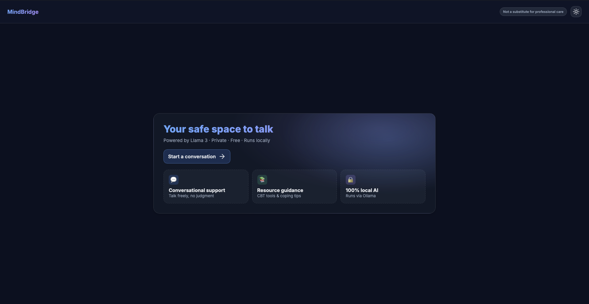
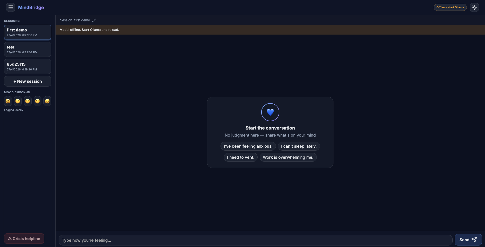
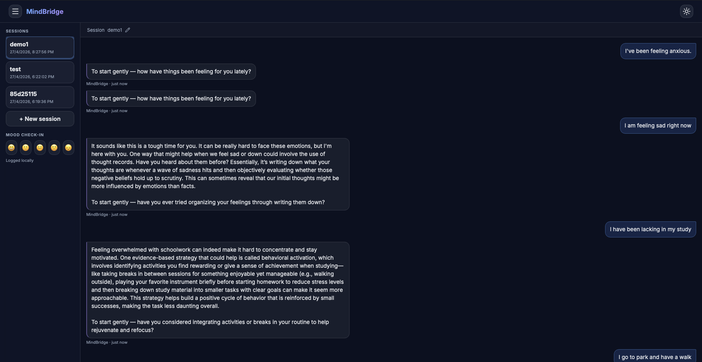

# MindBridge

Local-first mental wellness chat experience built with Flask + Jinja2, streaming AI responses from Ollama, and a privacy-first storage model.

> MindBridge is **not** a substitute for professional mental health care.  
> If someone is in immediate danger, call local emergency services.

---

## Quick Start (2 Minutes)

Run this if you want the fastest setup:

```bash
cd mindbridge
python3 -m venv .venv
source .venv/bin/activate
pip install -r requirements.txt
ollama pull phi3:mini
ollama serve
```

Open a second terminal:

```bash
cd mindbridge
source .venv/bin/activate
python app.py
```

Then launch: `http://127.0.0.1:5000`

---

## Visual Preview

### 1) Landing Page (`landingpage.png`)

> Repository file used: `landing_page.png`  
> (named with underscore in this project)



What this screen does:

- introduces MindBridge with a calm, trust-building hero
- provides a clear CTA to start chat immediately
- communicates privacy/local-first nature at first glance
- includes topbar controls like branding and theme toggle

### 2) Main Chat Interface (`interface.png`)



What this screen does:

- displays the active session conversation thread
- allows message sending with streaming AI response behavior
- gives quick access to session switching and mood check-in
- keeps crisis support action visible from the chat shell

### 3) Runtime / Working State (`run_time.png`)



What this screen does:

- shows the app while an active conversation is in progress
- reflects dynamic chat states (typing/streaming/response updates)
- demonstrates usability of composer and thread scroll behavior
- helps verify real runtime UX after launching the project

---

## Why MindBridge

MindBridge is designed for safe, low-friction emotional support with:

- private local AI inference via Ollama
- session-based chat with message history
- mood check-ins logged per session
- crisis detection and crisis banner escalation
- live token streaming in the chat UI
- offline model health checks and status feedback

---

## Tech Stack / Frameworks

### Backend

- `Python 3.10+`
- `Flask` (routing + server rendering)
- `Flask-CORS`
- `python-dotenv`
- `LangGraph` + `langchain-community` (agent orchestration layer)
- `ollama` Python client

### Frontend

- `Jinja2` templates
- `Vanilla JavaScript`
- Single stylesheet (`main.css`)
- `Lucide` icons (CDN)
- `Inter` font (Google Fonts)

### Data Layer

- Default: `SQLite` (`mindbridge.db`)
- Optional: `MongoDB` (if `MONGO_URI` is configured)

---

## Project Structure

```text
mindbridge/
├── app.py
├── requirements.txt
├── routes/
│   ├── chat.py
│   ├── health.py
│   └── session.py
├── agents/
├── llm/
├── db/
├── templates/
│   ├── base.html
│   ├── index.html
│   └── chat.html
└── static/
    ├── css/main.css
    └── js/chat.js
```

---

## Prerequisites

Install these first:

1. **Python 3.10 or newer**
2. **pip**
3. **Ollama**: [https://ollama.com](https://ollama.com)
4. One local model (default used by project: `phi3:mini`)

Pull the default model:

```bash
ollama pull phi3:mini
```

---

## Installation

From the `mindbridge` directory:

```bash
cd mindbridge
python3 -m venv .venv
source .venv/bin/activate
pip install --upgrade pip
pip install -r requirements.txt
```

---

## Configuration

This app reads environment variables at startup:

- `OLLAMA_BASE_URL` (default: `http://localhost:11434`)
- `OLLAMA_MODEL` (default: `phi3:mini`)
- `MONGO_URI` (optional; if set, MongoDB is used instead of SQLite)
- `SECRET_KEY` (optional, recommended for production)

Example setup:

```bash
export OLLAMA_BASE_URL="http://localhost:11434"
export OLLAMA_MODEL="phi3:mini"
# export MONGO_URI="mongodb://localhost:27017"
# export SECRET_KEY="change-me"
```

---

## How To Run

### 1) Start Ollama

```bash
ollama serve
```

### 2) Start MindBridge

In a second terminal:

```bash
cd mindbridge
source .venv/bin/activate
python app.py
```

### 3) Open in browser

`http://127.0.0.1:5000`

---

## Usage Guide

### Landing Screen

- open the app root `/`
- use theme toggle (light/dark) from topbar
- click **Start a conversation** to enter chat

### Chat Experience

- create/select sessions from sidebar
- type message and press:
  - `Enter` to send
  - `Shift + Enter` for newline
- watch streaming assistant response in real-time
- use mood row for quick emotional check-in
- click crisis helpline button for immediate resources

### Session Features

- each chat belongs to a session ID
- session history persists in storage
- inline session title is editable in chat header

### Safety + Reliability

- `/health` controls offline state UI
- crisis-risk messages trigger crisis banner + call action
- helpline alert is always available in sidebar/drawer

---

## API Endpoints Used By UI

- `POST /chat` -> streamed assistant response (SSE-like data events)
- `GET /health` -> Ollama reachability check
- `POST /session/new` -> create new session
- `GET /session/list?limit=25` -> fetch recent sessions
- `GET /session/<session_id>/history` -> session transcript + risk + mood
- `POST /session/<session_id>/mood` -> mood logging

---

## Wireframe Blueprint (Implemented UI)

### 1) Landing Page

- sticky frosted topbar
- gradient brand wordmark
- hero card with radial mesh interaction on mouse move
- feature cards with hover lift and icon badges
- CTA with sliding arrow animation

### 2) Chat Desktop Shell

- topbar with sidebar toggle + offline pill + theme toggle
- collapsible glass sidebar with sessions + mood row + crisis CTA
- crisis banner with pulsing left border + tel link
- editable session title row
- animated user/AI bubbles + streaming cursor behavior
- thread scroll FAB to jump to latest messages
- composer with focus ring and send-state feedback

### 3) Empty State

- centered conversation starter card
- calm visual icon and supportive copy
- prompt suggestion chips with staggered entrance animation
- one-click chip insert into composer

### 4) Mobile Drawer Pattern

- chat remains full width
- menu opens bottom sheet (`<= 860px`)
- sheet contains sessions, mood controls, and crisis CTA
- tap overlay to close drawer
- composer stays sticky at bottom

---

## Troubleshooting

### App shows "offline"

- confirm Ollama is running: `ollama serve`
- verify model exists: `ollama list`
- check `OLLAMA_BASE_URL` and `OLLAMA_MODEL`

### No response or stalled stream

- ensure selected model is installed locally
- restart app and Ollama server
- verify `/health` returns `{"status":"ok"}`

### Database notes

- SQLite file is created automatically (`mindbridge.db`)
- if `MONGO_URI` is set, data is stored in MongoDB database `mindbridge`

---

## Production Notes

This repository is optimized for local development. Before production:

- disable debug mode
- set secure `SECRET_KEY`
- add authentication and rate limiting
- put app behind a proper WSGI/ASGI server and reverse proxy
- implement stronger audit and safety policies

---

## Safety Reminder

MindBridge can support reflection and coping, but it does not replace trained clinicians.  
For urgent risk, use emergency services or local helplines immediately.

